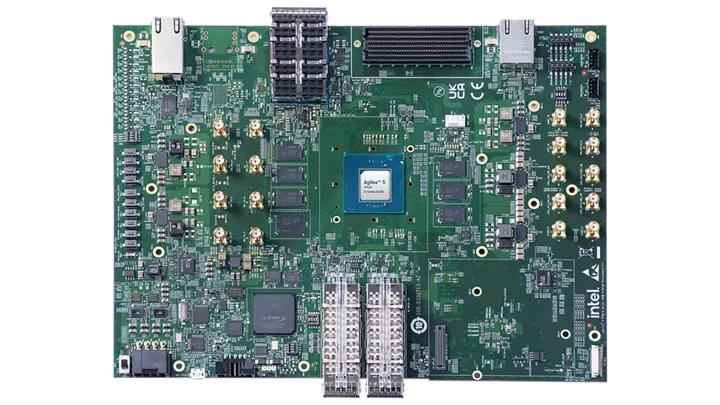
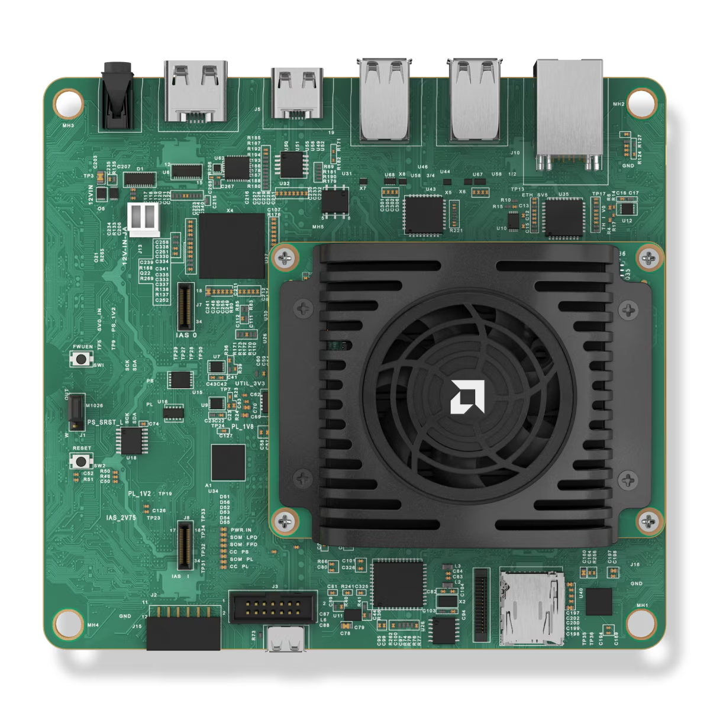
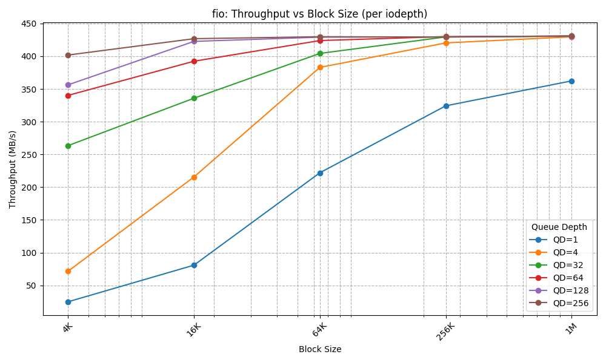
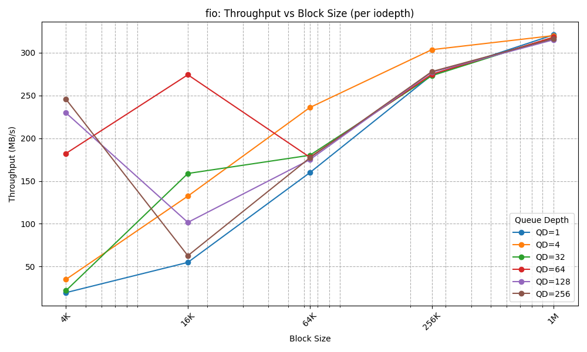
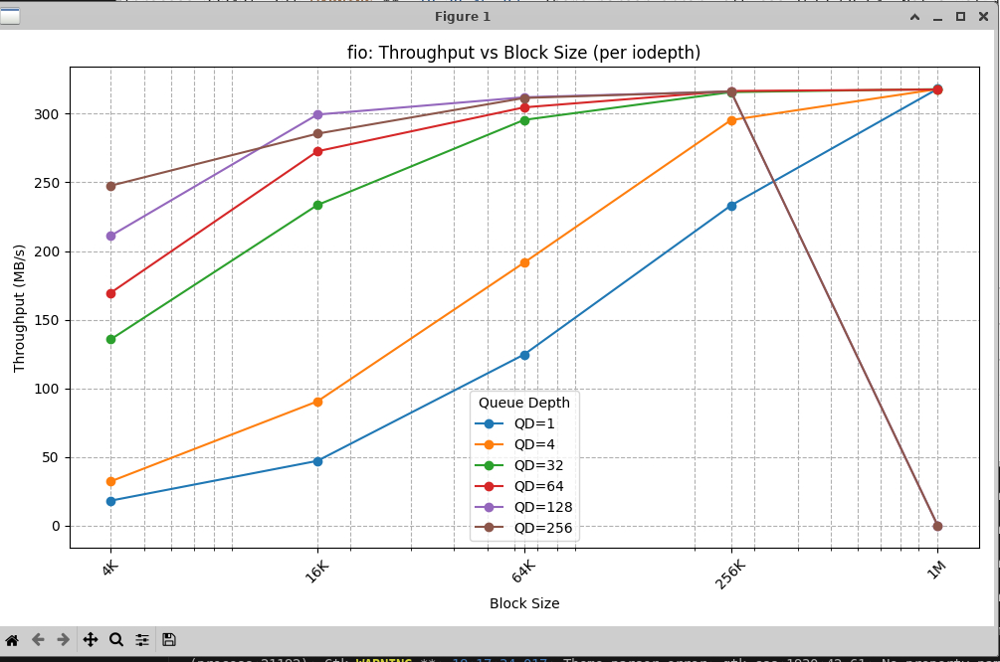
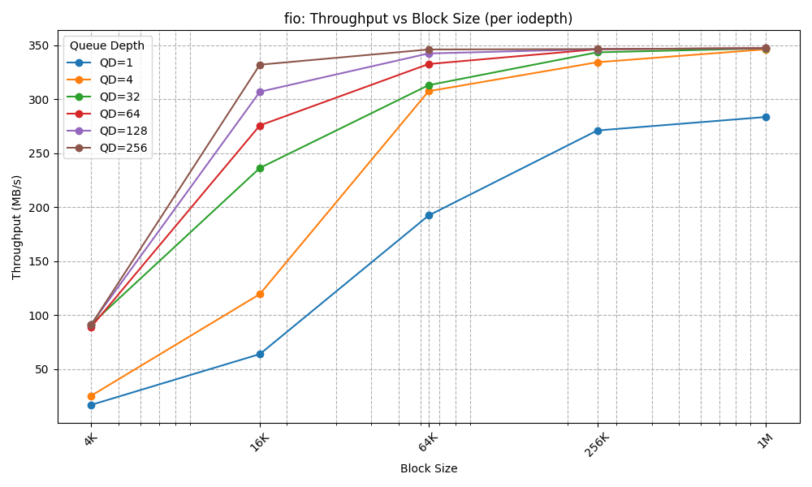

# USB 3.1 Gen 1 Benchmarking of Agilex 5 HPS

This repository contains resources I used for benchmarking the USB 3.1 interface on Agilex 5 HPS.

## Background

These benchmarks are designed to measure peak throughout reading and writing from device memory to a USB flash drive. The following were taken into consideration:

1. Choose a flash drive with a higher read/write speed than the devkit is rated for (to avoid the flash drive being a bottleneck)
2. Choose sequential reads and writes for optimal throughput.
3. Choose large block sizes to minimize I/O requests. This reduces CPU overhead and helps ensure that the CPU does not bottleneck the throughput.
4. Choose large I/O buffers to saturate the drive bandwidth.
5. Sweep across different combinations of block size and buffer depth to characterize the interface, and verify that the drive's bandwidth is saturated

## Methods

Follow the instructions below to reproduce the results of this benchmark for yourself.

### Pre-requisites

This benchmark was conducted using [PNY DUO LINK™ V3 USB 3.2 Gen 2 Type-C® Dual Flash Drive](https://www.pny.com/PNY-DUO-Link-V3-USB-3-2-Gen-2-Type-C-OTG?sku=P-FDI256DULNK3TYC-GE) USB flash drive. This USB flash drive was chosen because it supports up to USB 3.2 Gen 2 10 Gbps reads (1000 MB/s) and writes (800 MB/s). These were verified using [CrystalDiskMark](https://sourceforge.net/projects/crystaldiskmark/) on my personal machine.

For FPGA hardware, the following development kits were used:

* [Agilex™ 5 FPGA E-Series 065B Premium Development Kit](https://www.intel.com/content/www/us/en/products/details/fpga/development-kits/agilex/a5e065b-premium.html)


* [Kria KV260 Vision AI Starter Kit](https://www.amd.com/en/products/system-on-modules/kria/k26/kv260-vision-starter-kit.html)


### Instructions

You can run the benchmarks and generate graphics as follows:

1. Ensure that `fio` is available on your devkit, either by installing it from a package manager or including it in your root file system as part of your build process.
2. Copy this repository to your devkit.
3. Run `fio`:
   ```
   fio bs_qd_sweep.fio --output=bs_qd_results.json --output-format=json 
   ```
4. Run the `bs_qd_graph.py` script:
   ```
   python3 bs_qd_graph.py bs_qd_results.json
   ```
   If you don't have a desktop GUI available on your devkit, you can copy the `bs_qd_results.json` over to a workstation to generate the graphics.

## Results

The following graphs result from running the code on various test platforms.



Workstation 



Agilex™ 5 - 20s runtime



Agilex™ 5 - 40s runtime
 


KV260 